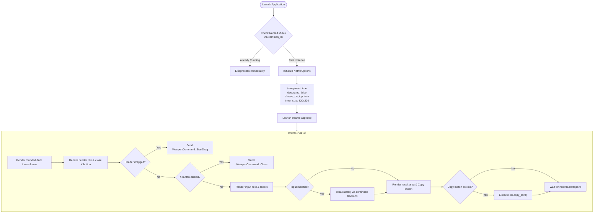

**English** | [日本語版](../ja/DIAGRAM.md)

# System Diagrams (DIAGRAM.md)

This document visually explains the execution flow of the CLI version and the architecture of the GUI desktop app using diagrams.

---

## 1. CLI Execution Flow

```mermaid
graph TD
    Start([Start Process]) --> CheckArgs{Arguments >= 2?}
    
    CheckArgs -- No --> PrintHelp[Output usage to stderr]
    PrintHelp --> ExitFail([Exit Code 1])
    
    CheckArgs -- Yes --> CheckHelp{Arg 1 is --help, -h?}
    CheckHelp -- Yes --> PrintDetailHelp[Output detailed help to stdout]
    PrintDetailHelp --> ExitSuccess([Exit Code 0])
    
    CheckHelp -- No --> CheckVersion{Arg 1 is --version, -v, -V?}
    CheckVersion -- Yes --> PrintVersion[Output 'bunka version' to stdout]
    PrintVersion --> ExitSuccess
    
    CheckVersion -- No --> ParseVal{Parse Arg 1<br>(f64 or % notation)}
    
    ParseVal -- Failed --> PrintParseError[Output invalid decimal/percent error to stderr]
    PrintParseError --> ExitFail
    
    ParseVal -- Success val --> InitParams["Default values:<br>max_den = 100,000<br>tolerance = 1e-6"]
    
    InitParams --> LoopArgs{Loop remaining args<br>i = 2 .. args.len()}
    
    LoopArgs -- Processing --> CheckOpt{Evaluate args[i]}
    
    CheckOpt -- -d / --max-den --> ParseMaxDen{Parse next arg as positive integer}
    ParseMaxDen -- Success --> UpdateMaxDen[Update max_den, i += 2]
    UpdateMaxDen --> LoopArgs
    ParseMaxDen -- Failed --> OptError[Output option error to stderr]
    OptError --> ExitFail
    
    CheckOpt -- -t / --tolerance --> ParseTol{Parse next arg as positive float}
    ParseTol -- Success --> UpdateTol[Update tolerance, i += 2]
    UpdateTol --> LoopArgs
    ParseTol -- Failed --> OptError
    
    CheckOpt -- Other --> OptError
    
    LoopArgs -- Done --> InitAlgo[Initialize: h1, h2, k1, k2, r, a, step = 0]
    
    InitAlgo --> LoopCF{Steps <= 50?}
    
    LoopCF -- Yes --> CalcConvergent["Calculate convergent fraction h_n, k_n"]
    CalcConvergent --> CheckDen{Denominator k_n > max_den?}
    
    CheckDen -- Yes --> BreakLoop[Break loop: adopt previous convergent]
    CheckDen -- No --> UpdateError[Calculate approximation & absolute error]
    
    UpdateError --> ErrorCriteria{Error <= tolerance or fractional r ~ 0?}
    ErrorCriteria -- Yes --> BreakLoop
    ErrorCriteria -- No --> PrepNext["Update residual r = 1 / (r - a)<br>Integer part a = floor(r)"]
    PrepNext --> LoopCF
    
    LoopCF -- No --> OutputResult[Format numerator/denominator]
    BreakLoop --> OutputResult
    
    OutputResult --> PrintResult[Print 'numerator/denominator' to stdout]
    PrintResult --> ExitSuccess
```

---

## 2. GUI Execution Architecture


